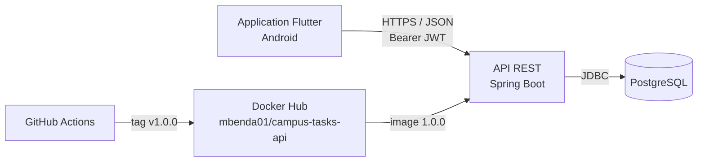
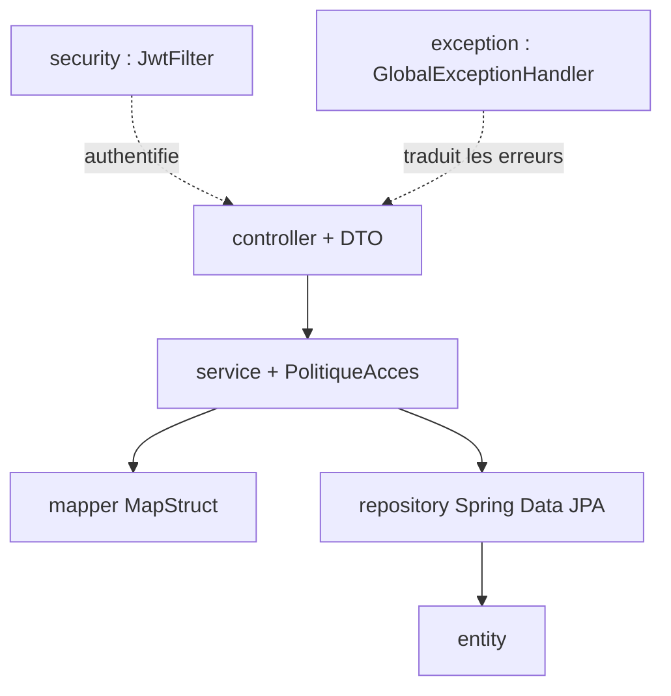
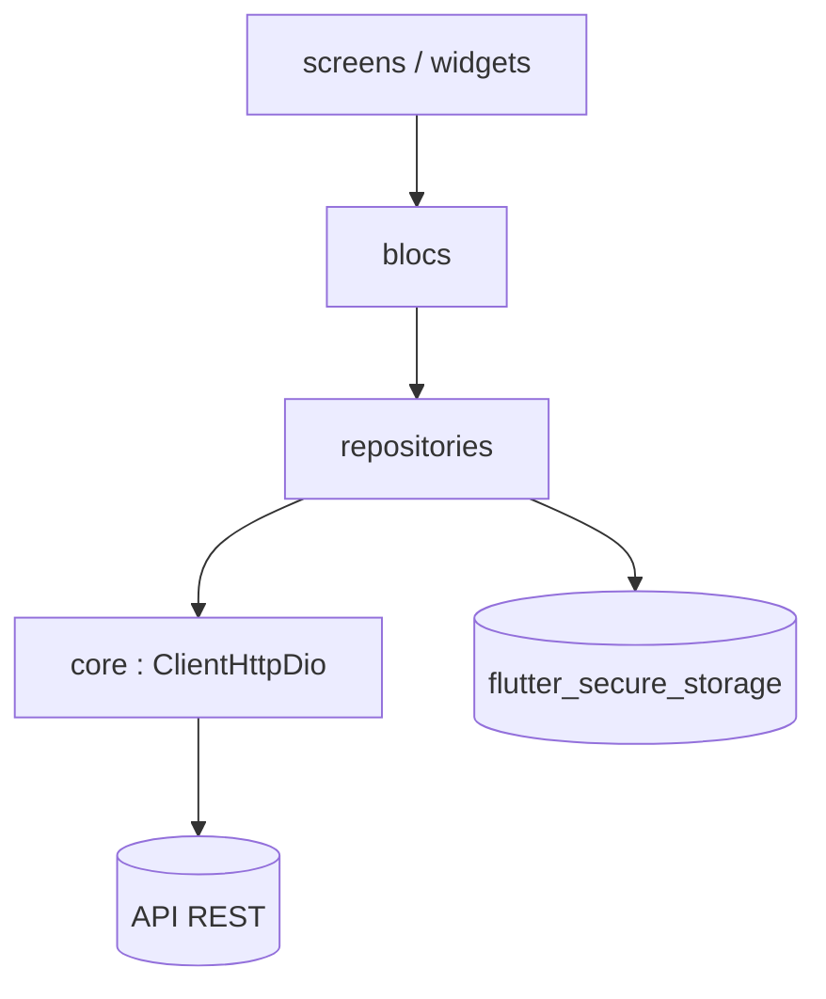

# Architecture

## Vue d'ensemble

| Composant | Responsabilité |
|---|---|
| Application Flutter | Interface mobile, gestion de l'état (BLoC), stockage sécurisé des jetons, échanges HTTPS avec l'API |
| API REST Spring Boot | Authentification, autorisations, validation des données, règles de gestion |
| PostgreSQL | Stockage persistant des comptes, des matières et des tâches |

## Backend

Organisation en couches :

- **controller** : routes `/api/v1/...`, validation des DTO (`@Valid`), réponses `ApiResponse`.
- **service** : orchestration, transactions, contrôle d'accès par propriétaire.
- **entity** : modèle de domaine riche. Les règles de statut, de retard et d'appartenance sont codées dans les entités.
- **repository** : requêtes dérivées, requêtes JPQL et `Specification` pour les filtres combinables.
- **security** : jetons JWT (accès et rafraîchissement), filtre d'authentification, réponses JSON 401 et 403.

## Application mobile

- Les **écrans** émettent des événements vers les **blocs** et réagissent à leurs états.
- Les **blocs** appellent les **repositories**, définis par une interface et implémentés côté API.
- Le **client HTTP** ajoute le jeton à chaque requête, renouvelle le jeton en cas de 401 et traduit les erreurs HTTP en erreurs typées (`ErreurValidation`, `ErreurConflit`, `ErreurReseau`, etc.).

## Choix techniques

| Choix | Raison |
|---|---|
| JWT accès (15 min) + rafraîchissement (7 jours) | API sans session ; un jeton d'accès volé n'est exploitable que peu de temps |
| Réponse 404 pour la ressource d'un autre étudiant | ne pas révéler l'existence des données d'autrui |
| Refus de supprimer une matière contenant des tâches | éviter la perte silencieuse de données |
| Image Docker multi-étapes, utilisateur non-root | image légère, surface d'attaque réduite |
| Configuration par variables d'environnement | aucun secret dans le code ; séparation développement / production |
