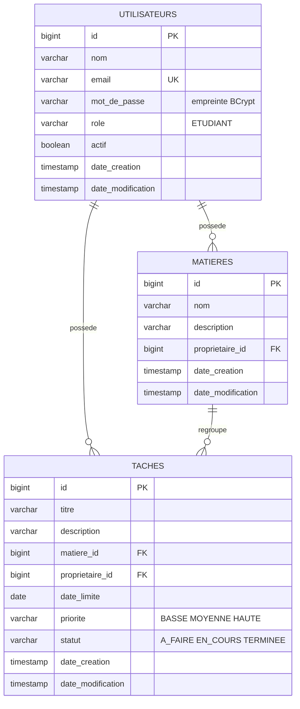

# Base de données

PostgreSQL 17. Le schéma est généré par Hibernate à partir des entités JPA (`spring.jpa.hibernate.ddl-auto=update`).

## Schéma

Les trois tables portent aussi les colonnes d'audit `cree_par` et `modifie_par`.

## Contraintes

| Table | Contrainte | Rôle |
|---|---|---|
| `utilisateurs` | `email` unique | un compte par adresse |
| `matieres` | unique (`proprietaire_id`, `nom`) | pas deux matières de même nom pour un étudiant |
| `taches` | `matiere_id` et `proprietaire_id` non nuls | une tâche appartient toujours à une matière et à un étudiant |
| `taches` | index (`proprietaire_id`, `statut`) et (`proprietaire_id`, `date_limite`) | rapidité des filtres et du tableau de bord |

## Règles de gestion

- Une tâche ne peut être rattachée qu'à une matière **du même étudiant**. Cet invariant est vérifié dans l'entité `Tache`.
- Une tâche est **en retard** si `date_limite < aujourd'hui` et `statut <> TERMINEE`.
- La **suppression d'une matière** est refusée (409) tant que des tâches y sont rattachées.
- La **date de création** est enregistrée automatiquement (audit JPA).
